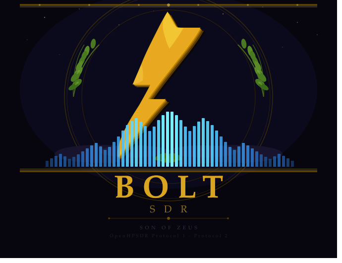

<p align="center">
  
</p>

# Bolt SDR

**Bolt SDR is a stripped-down, transceiver-focused SDR server built on the foundation of [OpenHPSDR Zeus](https://github.com/OpenHPSDR-Zeus-org/openhpsdr-zeus).**

Bolt is the son of Zeus — same core, no overhead.

---

## What is Bolt SDR?

Bolt SDR takes the OpenHPSDR Zeus server core and removes everything that is not a transceiver function. No chat, no DX cluster, no logbook, no plugin system, no remote access, no AI net monitoring — just radio.

The goal is a clean, headless-capable SDR server that:
- Connects to OpenHPSDR hardware (Protocol 1 and Protocol 2)
- Provides a minimal web UI for transceiver operation
- Exposes TCI for external apps (FT8, CW decoders, FreeDV)
- Supports CAT control (Kenwood TS-2000 dialect)
- Supports MIDI controller mapping

External apps connect via TCI — they do not live inside Bolt SDR.

---

## Hardware support

| Hardware | Protocol |
|---|---|
| Hermes Lite 2 | Protocol 1 |
| Red Pitaya (HPSDR firmware) | Protocol 1 |
| Apache Labs ANAN-7000DLE, 8000DLE | Protocol 2 |
| ANAN G2 | Protocol 2 |

---

## What was removed from Zeus

- Plugin system (Zeus.Plugins.*)
- VST / Audio Unit bridge
- Chat and operator messaging
- DX cluster and spotting (POTA, SOTA)
- KiwiSDR integration
- WSJT-X / FT8 / FreeDV built-in decoders
- Remote WebRTC access
- CloudLog / LoTW integration
- QRZ lookup
- AI net monitoring (Voyeur)
- Desktop app (Photino)
- Mobile app

These functions can be implemented as external TCI apps.

---

## Architecture

```
HL2 / ANAN G2
     |
     | Protocol 1/2 (UDP)
     v
+-----------------------------+
|         Bolt SDR            |
|  WDSP DSP engine            |
|  RadioService               |
|  TxService / PureSignal     |
|  StreamingHub (WebSocket)   |
|  CAT server (TCP)           |
|  MIDI mapper                |
|  TCI server                 |
+----------+------------------+
           |
    +------+------+
    |             |
 Web UI       TCI apps
(browser)   (FT8, CW, etc.)
```

---

## Building

### Requirements

- .NET 10 SDK
- Node.js 22 LTS + pnpm (for frontend)
- Windows (primary), Linux (headless server)

### Backend

```bash
git clone https://github.com/pe5jw/bolt-sdr.git
cd bolt-sdr
dotnet build Bolt.slnx -p:Platform="Any CPU"
```

---

## Status

| Component | Status |
|---|---|
| Backend — Protocol 1/2, WDSP, DSP | Compiles clean |
| BoltHost.cs — server entry point | Done |
| CAT, MIDI, TCI | Present |
| BoltServer — executable entry point | In progress |
| BoltEndpoints — REST/WebSocket API | In progress |
| Frontend — Vite + React UI | In progress |

---

## Based on

Bolt SDR is built on the foundation of **OpenHPSDR Zeus**, created by:

- Brian Keating (EI6LF)
- Douglas J. Cerrato (KB2UKA)
- Ramon Martinez (EA5IUE)
- Christian Suarez (N9WAR)
- and contributors

Zeus source: https://github.com/OpenHPSDR-Zeus-org/openhpsdr-zeus

The Zeus team built something excellent. Bolt SDR exists because of their work.

---

## License

GNU General Public License v2.0 or later — see LICENSE.

Bolt SDR is a derivative work of OpenHPSDR Zeus (GPL-2.0-or-later). All original copyright notices are preserved. See ATTRIBUTIONS.md for full provenance.

---

## Author

PE5JW — 2026
